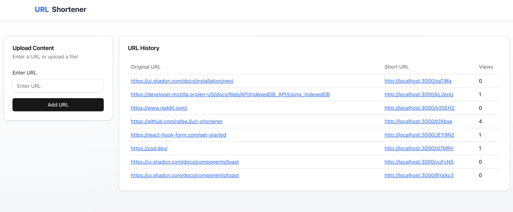

# URL Shortener



## Getting started
You will need Docker (inc. compose), and node.js installed for this app to work.

```bash
npm run stack
```

Open [http://localhost:3000](http://localhost:3000) with your browser to see the result.

## High Level Structure
`/src/app` - Routes

`/src/db` - Drizzle Postgres definition

`/src/features` - Main features of the app ([Screaming architecture](https://profy.dev/article/react-folder-structure))

`/src/components` - ShadCN components

## What does the app do

Authenticate the user using cookies and middleware. I didn't want to spend time implementing auth and wanted to focus on actual implementation.

Currently the app shorten URLs that the user enters into the form. It stores them in a Postgres SQL database, alongside a generated short url.

When the a shortened user is clicked - the user is navigated to the destination URL. A visit is also tracked so that the owner of the URL can track how many times the URL is click.

## What the app doesnt do
Due to lack of time, I could not implement the upload of a file. However I would approach this problem in the following manner:

1) create blob storage bucked (S3, GCP bucket, Vercel Blob etc.)
2) create a form (similar to how I have created the URL form) that takes in a file
3) generate a pre-signed url for whatever blob storage to allow upload (nextjs has size limits API route, so this is a workaround)
4) On success upload, generate a shortened url from the generated url and save in db

( I did something similar for my own Wedding website, so I have examples of doing something like this in the past.)

## Improvements
- proper authentication (eg clerk, firebase)
- use AWS resources
- use terraform
- dockerise apps to make deployments simple
